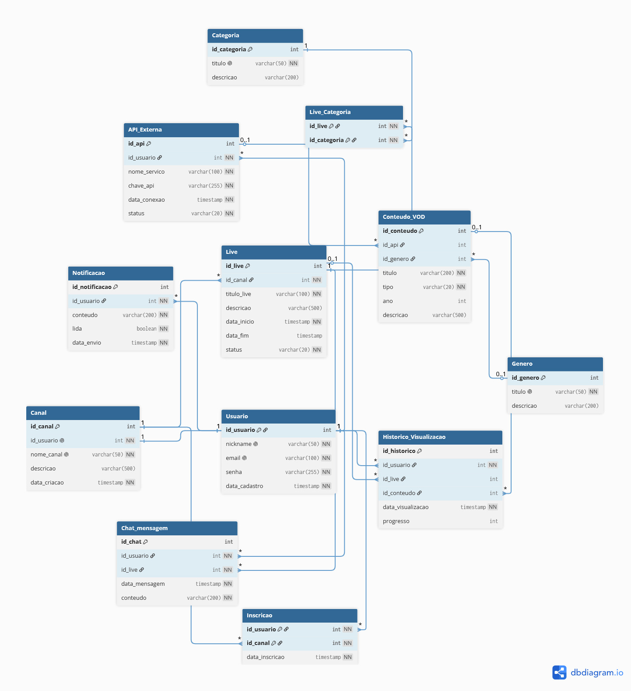

# omniStream Database 


Modelagem e implementação de um banco de dados relacional completo para uma plataforma de streaming e transmissões ao vivo (estilo Twitch/YouTube), focado em escalabilidade, integridade de dados e alta disponibilidade.

---

## 📋 Sobre a Plataforma de Streaming Híbrida

Atualmente, usuários que desejam consumir conteúdo digital de forma completa — assistindo a filmes, séries e transmissões ao vivo — se veem obrigado a utilizar múltiplas plataformas separadas, cada uma exigindo um cadastro diferente, uma assinatura própria e um aplicativo instalado. Essa fragmentação gera frustração, custos elevados e dificuldade de gerenciamento por parte do usuário.

Para solucionar este problema, será desenvolvida a plataforma **OmniStream**, que centraliza em um único sistema tanto o streaming de conteúdo sob demanda (VOD) quanto as transmissões ao vivo (lives). Para suportar essa solução, existe a necessidade de implementar um banco de dados que organize seus usuários, conteúdos e assinaturas.

---

## ⚙️ Regras de Negócio e Requisitos do Banco de Dados

O modelo de dados foi projetado e normalizado seguindo estritamente os seguintes requisitos operacionais do ecossistema:

* **Core de Usuários e Canais:** O cadastro do usuário deve conter um identificador único gerado automaticamente, nickname, e-mail e senha. Cada usuário possui exatamente um canal associado. O cadastro do canal deve conter um identificador único gerado automaticamente, o nome do canal e uma descrição.
* **Transmissões ao Vivo e Categorias:** Cada canal pode realizar transmissões ao vivo. Cada transmissão deve conter um identificador único gerado automaticamente, título, descrição, data de início, data de fim e status, e deve pertencer a um e apenas um canal. Uma transmissão pode ser classificada em uma ou mais categorias, e uma categoria pode classificar mais de uma transmissão.
* **Interação via Chat:** Durante uma transmissão, os usuários podem enviar mensagens de chat. Cada mensagem deve conter um identificador único gerado automaticamente, o conteúdo da mensagem, a data de envio, e deve pertencer a um usuário e a uma transmissão.
* **Sistema de Inscrições:** Os usuários podem se inscrever em canais. Cada inscrição registra o usuário, o canal e a data em que foi realizada. Um usuário pode se inscrever em vários canais, e um canal pode ter vários inscritos.
* **Integração com Conteúdo Sob Demanda (VOD via API):** Além do conteúdo ao vivo, a plataforma permite que os usuários conectem APIs externas para acessar conteúdo sob demanda. Cada API cadastrada deve conter um identificador único gerado automaticamente, o nome do serviço, a chave de autenticação, a data de conexão e o status da conexão, e deve pertencer a um e apenas um usuário. Cada API pode fornecer um ou mais conteúdos, que devem conter um identificador único gerado automaticamente, título, tipo, ano de lançamento e descrição.
* **Histórico de Visualização:** O histórico de visualização registra o que cada usuário assistiu. Cada registro deve conter um identificador único gerado automaticamente, a data da visualização e o progresso, e deve estar associado a um usuário e a uma transmissão ao vivo ou a um conteúdo sob demanda.
* **Alertas e Notificações:** Os usuários recebem notificações da plataforma. Cada notificação deve conter um identificador único gerado automaticamente, o conteúdo da mensagem, a data de envio e um indicador se foi lida ou não, e deve pertencer a um e apenas um usuário.

---

## ☁️ Arquitetura em Nuvem

Para garantir que o sistema funcione de forma independente e profissional (sem depender de uma máquina local ligada), o banco de dados foi provisionado e hospedado na nuvem utilizando a plataforma **Aiven Cloud**, garantindo acesso simultâneo e seguro para múltiplos colaboradores e integrações de microsserviços.

---

## 📊 Estrutura do Banco de Dados (DER)

O modelo de dados mapeia com precisão todas as regras de negócio listadas acima através das tabelas principais (`Usuario`, `Canal`, `Inscricao`, `Live`, `Categoria`, `Live_Categoria`, `Conteudo_VOD`, `API_Externa`, `Chat_mensagem`, `Notificacao` e `Historico_Visualizacao`).



---

## 🛠️ Tecnologias Utilizadas

* **SGBD:** MySQL 8.0+
* **Hospedagem Cloud:** Aiven (Managed MySQL)
* **Ferramenta de Modelagem:** dbdiagram.io / MySQL Workbench
* **Segurança:** Conexão encriptada via protocolo SSL (Certificado CA)

---

## 🚀 Como Executar o Projeto Localmente

Se quiser replicar este banco de dados na sua máquina ou conectá-lo à sua própria instância Cloud, siga os passos abaixo:

### 1. Clonar o Repositório
```bash
git clone [https://github.com/seu-usuario/omnistream-database.git](https://github.com/seu-usuario/omnistream-database.git)
cd omnistream-database
